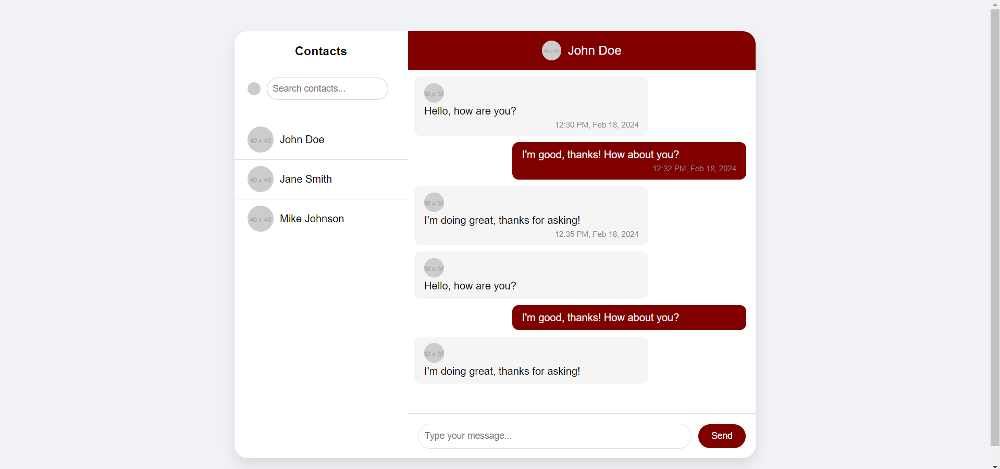

# Messaging-Website-Templates
Messaging Website

This is a simple HTML template for a chat interface featuring a sidebar with contacts list and a chat container.

## Usage

Simply open the `index.html` file in a web browser to view the chat interface.

## Structure

- **index.html**: Contains the HTML structure for the chat interface.
- **styles.css**: Contains the CSS styles for styling the chat interface.
- **script.js**: Contains the JavaScript code for dynamic functionality (e.g., sending messages).

## Features

- Contacts List: Displays a list of contacts on the left sidebar.
- Chat Container: Displays the chat interface for communicating with John Doe.
- Message Input: Allows users to type and send messages.
- Responsive Design: The interface is designed to work on various screen sizes.

## Preview

## Dependencies

No external dependencies required.

